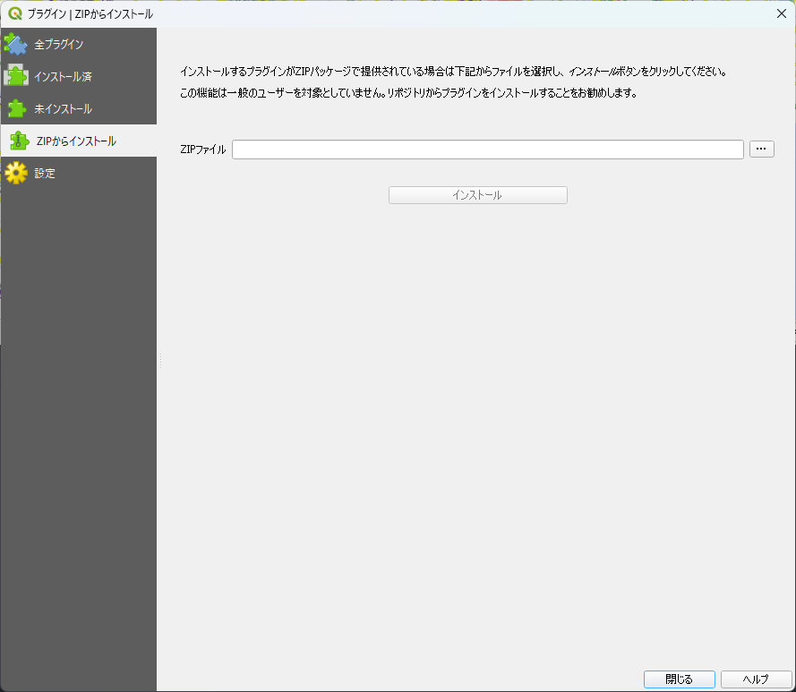
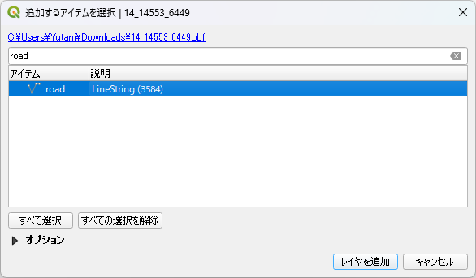
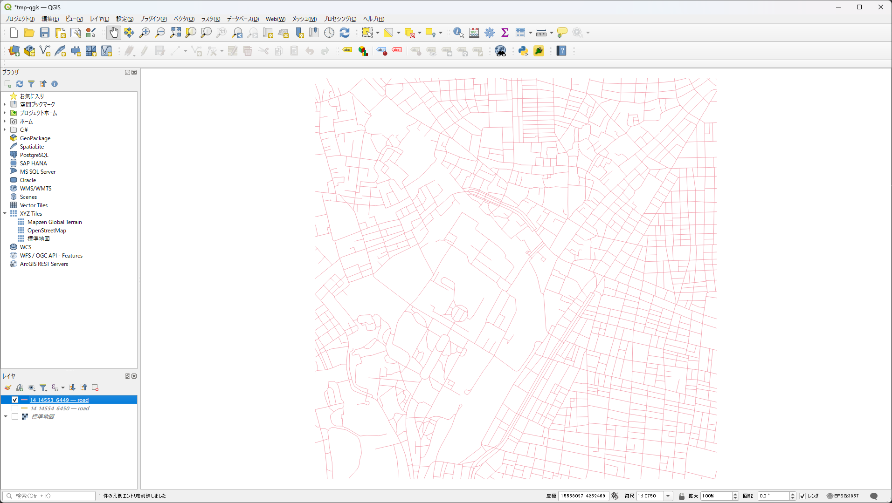
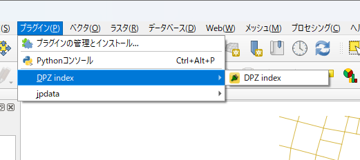
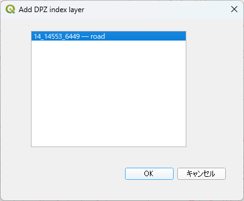
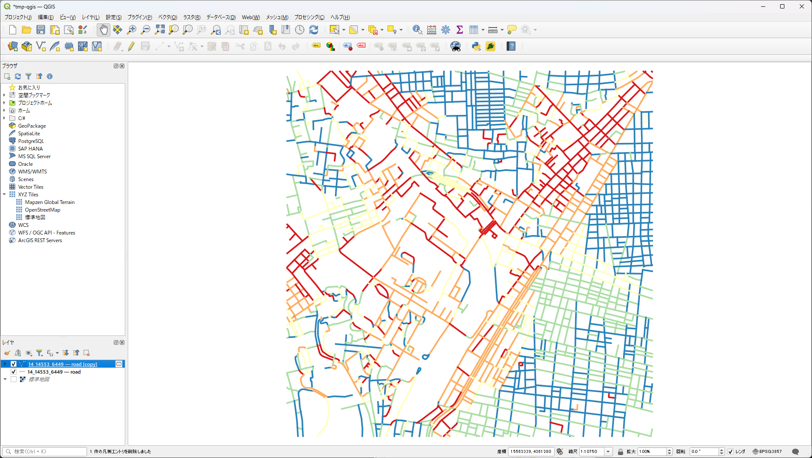

DPZ index plugin
================

これは、デイリーポータルZに掲載された記事「[道路を方角ごとに塗り分けると、その街のでき方がわかる](https://dailyportalz.jp/kiji/douro-hougaku-machi-no-dekikata)」で紹介された、道路を方角ごとに塗り分ける分類方法を QGIS 上で実現するプラグインです。実装は、Leaflet を使った実現方法の記事（[「道路を方角ごとに塗り分けると、その街のでき方がわかる :: デイリーポータルZ」 を Leaflet と地理院地図Vectorで](https://qiita.com/frogcat/items/3d795c5cbe026c372bf4)）をかなり参考にしました。

## インストール方法

このプラグインは、現時点では QGIS 公式のプラグインレポジトリには公開されていません。
[GitHub releases](https://github.com/yutannihilation/dpz-index-qgis-plugin/releases/) の最新のリリースから ZIP ファイル（`dpz_index.0.0.3.zip` といったファイル名のものです）をダウンロードし、
メニューの「プラグイン」 > 「プラグインの管理とインストール」 > 「ZIP からインストール」で ZIP ファイルを指定してインストールしてください。



## 仕組み

[「道路を方角ごとに塗り分けると、その街のでき方がわかる :: デイリーポータルZ」 を Leaflet と地理院地図Vectorで](https://qiita.com/frogcat/items/3d795c5cbe026c372bf4) の実装と同じく、線の始点と終点から角度（0～45°）を計算しています。
計算された値は `DPZ index` というフィールドに入り、シンボロジの色の設定に使われています。実際の値は属性テーブルから確認できます。

## 使い方

### 準備

このプラグインは、ポリラインのベクタレイヤーに対して使います。
以下の説明では、例として、実験的に提供されている[国土地理院ベクトルタイル](https://maps.gsi.go.jp/development/vt.html)を使用します。

まず、以下の URL を開き、`14_14554_6450.pbf`という名前で保存してください。東京周辺のタイルです。

```
https://cyberjapandata.gsi.go.jp/xyz/experimental_bvmap/14/14554/6450.pbf
```

次に、QGIS のウィンドウにこのファイルをドラッグアンドドロップ、もしくは「ベクタレイヤを追加」からこのファイルを指定してください。
このタイルには河川や鉄道など、さまざまな地物が入っているので、どれを追加するか選ぶダイアログが表示されます。
今回は、使いたいのは道路だけなので「road」を選択して追加します。



追加すれば、以下のように道路が表示されているはずです。



（出典：画面内に映っているのは[国土地理院][gsi]によって提供されているベクトルタイルです）

[gsi]: https://maps.gsi.go.jp/development/ichiran.html

### DPZ index plugin を使用

DPZ index plugin をプラグインメニューから選びます。



すると、対象のレイヤーを選ぶダイヤログが現れます。
塗り分けたいレイヤーを選択し、「OK」を押してください。



処理が成功すれば、以下のように、角度によって色分けされた道路が表示されているはずです。



（出典：画面内に映っているのは[国土地理院][gsi]によって提供されているベクトルタイルです）

## TODO

* 現在使っている `QgsField` のコンストラクタは、比較的最近の QGIS（3.38で確認）だと非推奨になっているので警告が出ます。
  一方、安定版（3.34）では新しいコンストラクタを使えないので、どちらでも動くように古いコンストラクタを使っています。
  現時点では、警告が出ていても動作には問題ないので無視してください。
